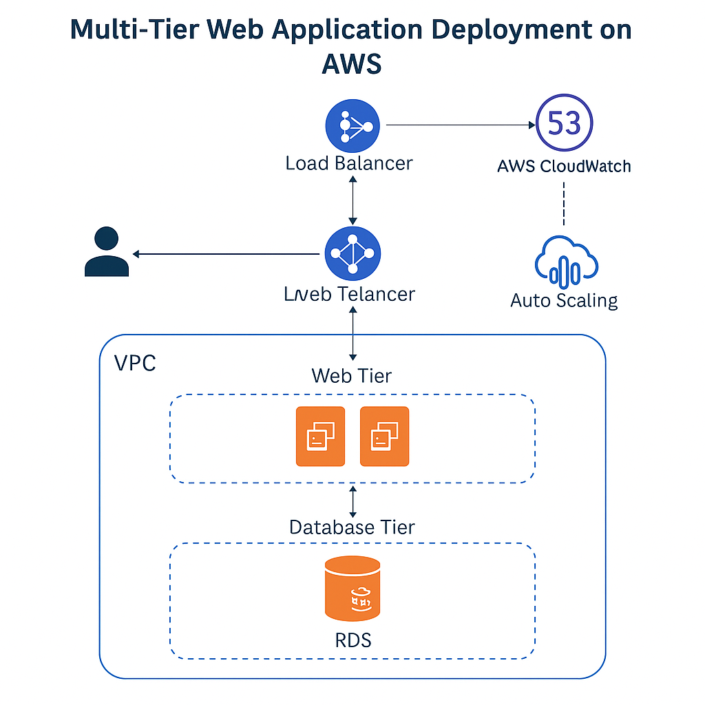

# Multi-Tier Web Application Deployment on AWS (LAMP Stack)

## 🚀 Project Overview
This project demonstrates the deployment of a multi-tier LAMP (Linux, Apache, MySQL, PHP) web application architecture on AWS. It includes a web tier hosted on EC2, a database tier on Amazon RDS, and a Load Balancer with Auto Scaling. The infrastructure is secure, scalable, and monitored using AWS services.

## 🧱 Architecture Diagram

## 🛠️ Technologies Used
- Amazon EC2
- Amazon RDS (MySQL)
- Amazon VPC (with subnets)
- Elastic Load Balancer (ELB)
- Auto Scaling Group
- Route 53 (DNS)
- CloudWatch (Monitoring & Logs)
- IAM Roles & Policies
- Linux (Amazon Linux 2)
- Apache, PHP, MySQL

## 🔧 Key Features
- Hosted a sample LAMP-based website on EC2
- Configured RDS as the backend database
- Load Balancer distributes traffic across EC2 instances
- Auto Scaling handles sudden traffic spikes
- Secure VPC with custom security groups and NACLs
- DNS mapping using Route 53
- Monitoring and alerting via CloudWatch

## 📁 Folder Structure
